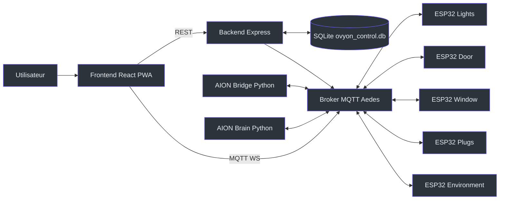
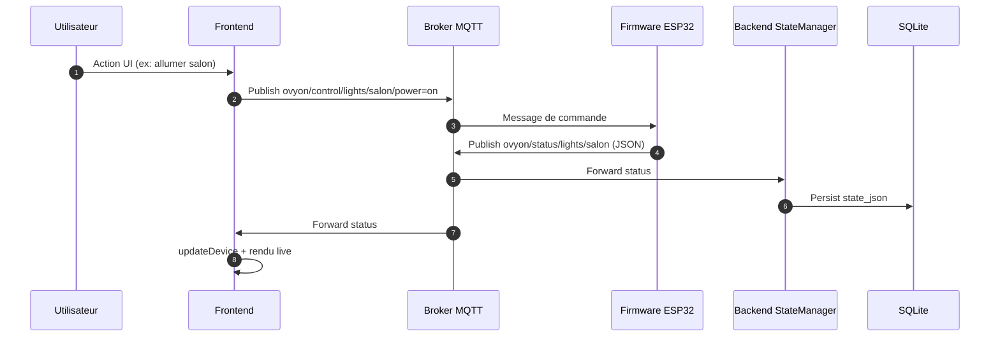

# OVYON Control - Presentation Complete

## 1) Resume executif
OVYON Control est un ecosysteme domotique local-first, pense pour fonctionner en contexte africain avec contraintes reelles: connectivite instable, budget limite, besoin d'accessibilite et de maintenance simple.

Le projet integre 4 couches principales:
- Frontend React/TypeScript (dashboard mobile-first)
- Backend Node.js/TypeScript (API REST + orchestration + persistence SQLite)
- Messagerie MQTT (broker Aedes + WebSocket pour le frontend)
- Edge IoT (firmwares ESP32 Lights, Door, Window, Plugs, Environment)

Une couche IA Python (`aion.py`, `aion_brain.py`) complete le systeme pour la commande naturelle et des suggestions proactives.

## 2) Probleme et proposition de valeur
Les guides projet et le memoire convergent sur 3 enjeux:
- Continuer a piloter localement meme sans cloud
- Rendre la domotique plus abordable (ESP32 + MQTT + SQLite)
- Ouvrir l'usage a des commandes naturelles et multilingues

OVYON repond a cela par une architecture hybride:
- Coeur critique local (API, MQTT, etat)
- IA enrichie par LLM quand disponible
- Simulation Proteus pour valider la logique avant montage physique

## 3) Architecture globale (vue systeme)


## 4) Stack technique choisie
| Couche | Stack | Role dans OVYON |
|---|---|---|
| UI | React 18, TypeScript, Vite, Tailwind, Framer Motion, Zustand | UX mobile/premium, controle temps reel, navigation par onglets |
| Communication | MQTT (`mqtt` JS) + WS broker | Liaison evenementielle UI <-> IoT |
| API/Orchestration | Node.js, Express, TypeScript | CRUD devices/regles, actions systeme, logs admin |
| Persistence | SQLite (`sqlite`, `sqlite3`) | Source locale des devices/regles |
| Broker IoT | Aedes + websocket-stream | Bus domotique local (1883 + WS 8083) |
| IA | Python, `paho-mqtt`, OpenAI SDK (OpenRouter) | Commande vocale + raisonnement proactif |
| Firmware | Arduino C++ (ESP32), PubSubClient, ArduinoJson, ESP32Servo, DHT | Execution physique sur noeuds specialises |
| Validation | PowerShell + tests TS/Vitest | Verification pre-soutenance (build/lint/test/syntax/compile firmware) |

## 5) Analyse module par module

### 5.1 Frontend (application OVYON)
Le frontend est pilote par un store Zustand central (`frontend/src/store/useStore.ts`):
- Connexion MQTT WS sur `ws://localhost:8083`
- Subscriptions: `ovyon/status/#`, `aion/transcript`, `aion/proactive`
- Synchronisation REST initiale:
  - `GET /api/devices`
  - `GET /api/rules`
- Actions critiques:
  - reset systeme (confirmation modal)
  - panic mode
  - biometrie (WebAuthn, fallback demo)
  - mode admin protege par PIN local

Pages clefs:
- `Dashboard.tsx`: vue grille + plan 2D, commandes directes lumiere/porte/fenetre/prises
- `VoiceControl.tsx`: etat connexion AION, historique commandes
- `Automations.tsx`: CRUD scenarios (UI)
- `Analytics.tsx`: stats de consommation derivees des etats devices
- `Settings.tsx`: broker, securite, appairage BLE/NFC simule, admin
- `Admin.tsx`: console logs systeme en temps reel
- `Vision.tsx`: cadrage produit/impact

Composants transverses:
- `AddModal`, `PairingModal`, `PinModal`, `ConfirmModal`
- Moteur feedback audio/haptique (`feedback.ts`)

### 5.2 Backend (API + etat + broker)
Le backend expose:
- `GET/POST/PUT/DELETE /api/devices`
- `GET/POST/PUT/DELETE /api/rules`
- `POST /api/rules/:id/toggle`
- `POST /api/system/reset`
- `POST /api/system/panic`
- `GET /api/admin/logs`

`stateManager.ts` gere:
- Init SQLite + tables `devices` et `rules`
- Cache en memoire (`Map`) + sync DB
- Journal systeme (memoire)
- Fonctions systeme: reset, panic, update globale

`broker.ts`:
- Demarre MQTT TCP (1883) et MQTT WebSocket (8083)
- Route chaque publish vers `handleMessage`

`messageHandler.ts`:
- Interprete `ovyon/control/...` et `ovyon/status/...`
- Mappe les topics en IDs applicatifs (`light_salon`, `door_main`, etc.)

### 5.3 IA (AION)
`aion.py`:
- Bridge interactif (entree console)
- Dictionnaire local (regex intentions)
- Fallback vers raisonnement LLM via OpenRouter
- Publie:
  - commandes `ovyon/control/...`
  - transcripts `aion/transcript`

`aion_brain.py`:
- Abonne `ovyon/status/#`
- Maintient un snapshot maison
- Lance une analyse periodique (10 min)
- Publie suggestion sur `aion/proactive`

### 5.4 Firmware ESP32 (IoT reel)
Noeuds implementes:
- `Lights.ino`: 3 zones PWM (salon/chambre/cuisine), topics power + brightness
- `Door.ino`: servo porte, action `open/close`
- `Window.ino`: servo position 0-100
- `Plugs.ino`: 2 relais + consommation simulee
- `Environment.ino`: DHT11 temp/humidity toutes ~15s

Tous utilisent:
- Reconnexion MQTT automatique
- Publication status retained
- Credentials via `firmware/wifi_config.h`

### 5.5 Simulation Proteus
`simulations/proteus/ovyon_sim_mega/ovyon_sim_mega.ino` permet:
- Emulation logique sans ESP32 reel
- Commandes serie (`LIGHT_SALON_ON`, `DOOR_OPEN`, `WINDOW_50`, `PLUG1_ON`, `STATUS`, etc.)
- Telemetrie periodique type `ovyon/status/sensor/env`

Objectif soutenance:
- Montrer preuve d'ingenierie (design/cablage/logique) meme si la maquette physique est indisponible.

## 6) Flux de donnees et de commande (comportement reel)


## 7) Simulation de fonctionnement demandee

### 7.1 Simulation de la plateforme (frontend + backend)
Scenario:
1. L'utilisateur ouvre l'app (Splash -> Home).
2. `initMqtt()` connecte le client WS et subscribe les topics.
3. `fetchData()` charge devices/regles depuis API.
4. L'utilisateur agit depuis Dashboard (toggle, slider, bouton porte).
5. Les statuts reviennent en live, l'UI se met a jour.
6. `Analytics` recalcule puissance/facture estimee a partir des etats.
7. `Admin` affiche les logs backend en polling.

Resultat attendu:
- Pilotage quasi temps reel, etat coherent entre API/DB/UI.

### 7.2 Simulation de la maquette (Proteus)
Scenario terminal virtuel:
1. Charger le `.hex` du sketch `ovyon_sim_mega.ino` dans Mega.
2. Lancer simulation.
3. Taper:
   - `LIGHT_SALON_ON`
   - `DOOR_OPEN`
   - `WINDOW_50`
   - `PLUG1_ON`
   - `STATUS`
4. Observer LEDs/servos + retour texte.

Resultat attendu:
- Validation logique complete commande -> action -> etat.

### 7.3 Simulation IA (AION reactif + proactif)
Scenario reactif:
1. Terminal AION: `allume la lumiere du salon`
2. Regex locale detecte `light_on`.
3. Publication MQTT de commande.
4. UI recoit transcript et affiche historique.

Scenario semantique:
1. Entrer une phrase contextuelle (ex: `je vais dormir`).
2. LLM genere un JSON de commandes multiples.
3. AION publie ces commandes et une reponse naturelle.

Scenario proactif:
1. `aion_brain.py` agrege les status capteurs/equipements.
2. Toutes les 10 min: analyse strategique.
3. Publie une alerte/suggestion `aion/proactive`.
4. Frontend notifie l'utilisateur.

### 7.4 Simulation globale de l'ecosysteme
Parcours de demo complet:
1. Dashboard: allumer salon + cuisine.
2. Door: ouvrir puis fermer (avec biometrie active si compatible).
3. Plugs: activer prise 1 et visualiser consommation.
4. Environment: visualiser temperature/humidite.
5. Voice: lancer commande AION.
6. Automations: activer/desactiver un scenario.
7. Admin: verifier logs.
8. Panic mode: forcer etat securise.

Resultat attendu:
- Preuve d'integration full-stack + IoT + IA dans un meme cycle.

## 8) Ce qui est fort pour la soutenance
- Architecture modulaire claire et defendable.
- Local-first reel (SQLite + MQTT local).
- Couverture fonctionnelle large (UI, IoT, IA, simulation).
- Documentation abondante (guides, scripts, memoire, plan oral).
- Script de verification industrialise (`scripts/verify-soutenance.ps1`).

## 9) Points techniques a assumer (transparence jury)
Ces points existent dans le code actuel et doivent etre expliques proprement:
- La doc historique parle de Gemini, mais le code IA actuel utilise OpenRouter (`OPENROUTER_*`).
- Le callback d'auth broker autorise de fait tous les clients (mode demo).
- Les regles d'automation sont persistees mais le moteur d'execution automatique est partiel/non explicite cote backend.
- Certaines valeurs UI sont simulees (ex: capteurs dans `Automations.tsx`).
- L'IA vocale actuelle est basee sur entree console (pas capture micro temps reel).

Ce n'est pas bloquant en soutenance si presente comme:
- "MVP fonctionnel robuste",
- "choix de stabilite demo",
- "roadmap claire de durcissement production".

## 10) Justification des choix de stack
- React + Zustand: rapidite de developpement + etat global lisible.
- MQTT: protocole IoT leger, parfait pour pub/sub device.
- SQLite: base embarquee simple, fiable pour single-node local.
- ESP32: excellent ratio cout/perf/disponibilite.
- Python pour IA: integration rapide APIs LLM + MQTT.
- Proteus: reduction du risque hardware avant integration physique.

## 11) Roadmap post-soutenance recommandee
1. Durcir securite broker/API (auth stricte, TLS MQTT, roles admin).
2. Ajouter vrai moteur d'automations cote backend (trigger -> action).
3. Uniformiser mapping IDs/topics (sensor et cas pluriels).
4. Brancher STT/TTS reel pour AION (micro/haut-parleur).
5. Instrumenter metriques reelles (latence, uptime, consommation).

## 12) Commandes de lancement (reference)
```bash
# Backend
cd backend && npm run dev

# Frontend
cd frontend && npm run dev

# IA
cd ai_voice && python aion.py
cd ai_voice && python aion_brain.py
```

Verification complete:
```powershell
powershell -ExecutionPolicy Bypass -File scripts\verify-soutenance.ps1 -SkipFirmware
```

## 13) Conclusion
OVYON Control est un projet de soutenance profond, coherent et concret: il ne se limite pas a une UI, mais integre un vrai backbone IoT local, une persistence exploitable, des firmwares specialises, une couche IA et une simulation materielle.

Le projet est suffisamment avance pour une demonstration "bout-en-bout" convaincante, tout en gardant des axes d'amelioration clairs vers un niveau pre-production.
